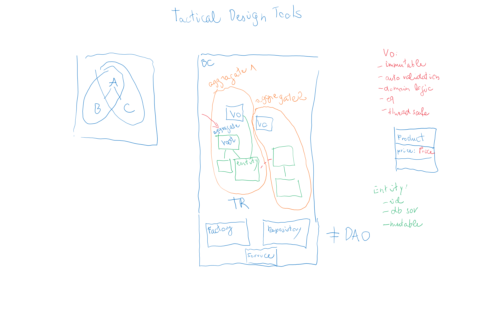

# DDD

## Ajánlott irodalom

* Implementing Domain-Driven Design
* [Alpha Code Channel](https://www.youtube.com/channel/UCmbnw2hZFf6JzWICZIPe9cg)
* [Letscode.hu podcast](https://soundcloud.com/letscodehu/sets/letscode-hu-podcast)
  * [DDD üzleti szemmel](https://soundcloud.com/letscodehu/ddd-uezleti-szemmel?in=letscodehu/sets/letscode-hu-podcast)

## Bevezetés

* Mikor és hol vágjunk?
* Top-down
* Ne tervezzünk meg mindent előre az utolsó részletig, evolutionary design
* OOP fogalmak fontossága
* Modellezés, modellalkotás
* DDD: modellezési eszközök, minták
* A legtöbb architektúrával használható: Event driven architecture, CQRS, Reactive and actor model, REST, SOA, microservices, cloud
* Rossz felépítés gyakori okai:
	* Az üzlet úgy tekint a szoftverfejlesztésre, mint költségre, és nem úgy, mint lehetőség, mint stratégiai komponens
	* Fejlesztők túl technológia közeliek
	* Túl nagy a jelentősége az adatbázisnak, és adatmodellnek, szemben a folyamatokkal
	* Fejlesztőknek a névadás nyűg, nem következetesek
	* Gyakran abból adódik, hogy nem értik meg az üzleti problémát, nem jó az interakció az üzlettel
	* Alapos tervezés nélküli, feature-ök folyamatos szállítása, Big Ball of Mud
	* Rétegek nem válnak szét kellően
	* Nem optimalizált, nem hatékony adatbázis lekérdezések, melyek blokkolják a normál folyamatokat
	* YAGNI, rossz absztrakciók
	* Túl szoros kapcsolat a komponensek között

## Strategic Design Tools

* Kontextusok		
* Problem space:
	* Domain, felosztható subdomains: core domain, supporting domains, generic domains
* Solution space
	* Domain model (osztályok), Bounded context, Ubiquitous language (ugyanarra a fogalomra ugyanaz a szó)
		* Példa (client fogalma a sales, support, accounting és orders területen)
	* Domain expert: mental model
	* Saját db, saját API
	* Farmos példa
	* Context mapping: bounded contextek közötti kapcsolat
		* partnership: két csapat egy BC-n dolgozik
		* shared kernel: van egy közös rész, ami viszonylag stabil
		* customer-supplier: customer kér, supplier valamikor valamit ad
		* conformist: customer maximálisan igazodik ahhoz, amit a supplier ad
		*	Anticorruption layer: saját BC-re átforgatás a customer-en belül
		* Open host service: van egy jól használható API
		* Published language: XML séma, JSON séma, Protobuf, Avro
		* Separate ways: nincs integráció
	* Kommunikáció
		* SOAP
		* REST
		* Messaging
* Domain megértése
* Technológiamentes

## Tactical Design Tools

* Kontextuson belüli komponensek
* Implementációs részletek
* BC - microservice - country hasonlat
* Value objects (sohat BigDecimal, float for money): immutable, auto validation, domain logic, eq, thread safe
* Entity: id, value objects és más entitásokkal kapcsolat, sor az adatbázisban, mutable
* Aggregate
	* Túl bonyolult objektum gráf
	* Egy tranzakciónyi
	* Root entity - teljes életciklust vezérli
	* Mindig konzisztens állapotban van
* Factory
	* Ha túl bonyolult az aggregate létrehozása
* Repository
	* Abban különbözik a DAO-tól, hogy csak aggregate-enként van, nem entitásonként
	* Betölti a kapcsolatokat is

## Tervezés

* UML, diagrammok, user story-k hatékonysága kérdőjeles
* Event storming - brainstorming a domain model átadására
* Eventekből indul ki
* Sorrendbe tenni
* Hozzákapcsolni a szerepköröket, commandokat
* BC-k azonosítása
* Kód duplikáció, követhetőség, karbantartás igény

## Kódminőség

## Említett architektúrális problémák

* Túl sok modul, százas nagyságrendű `pom.xml`
* Ha adott egy kalapács, mindent szögnek nézünk
* Túl új, ismeretlen technológiák használata
* Határidők