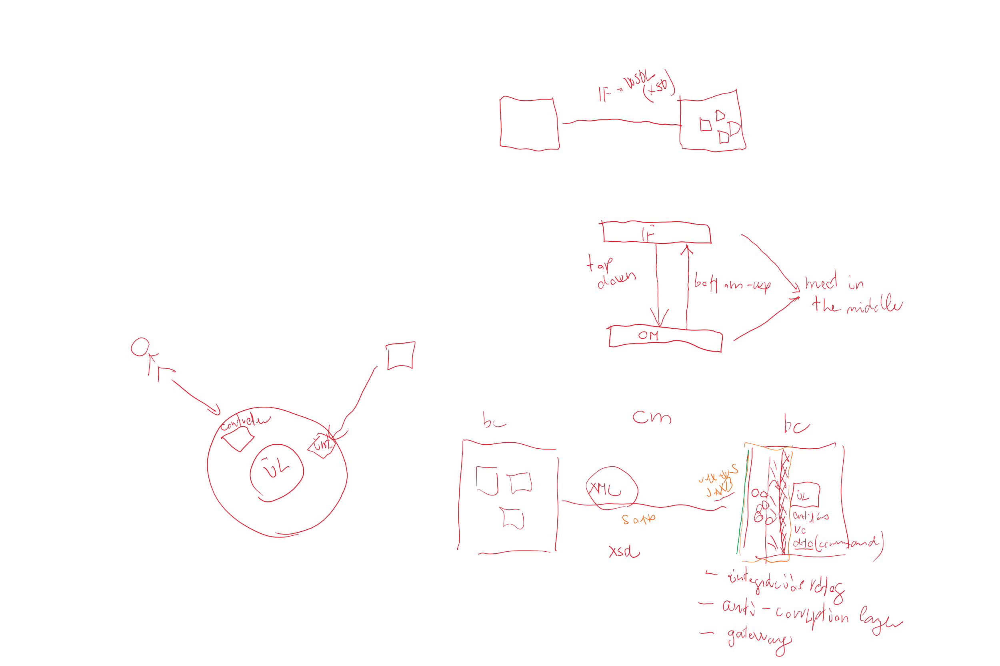
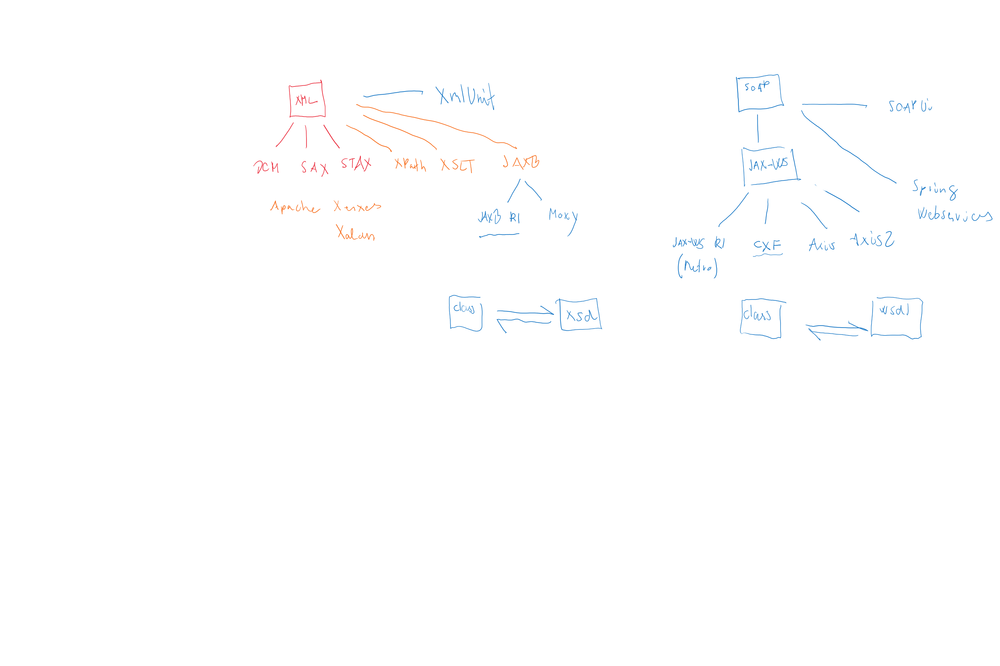
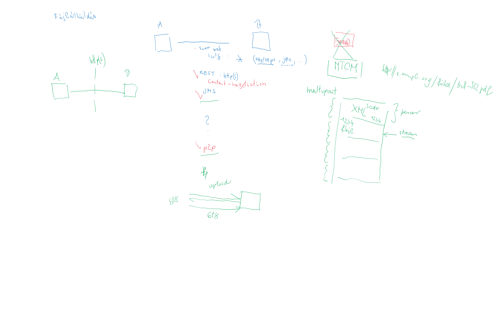
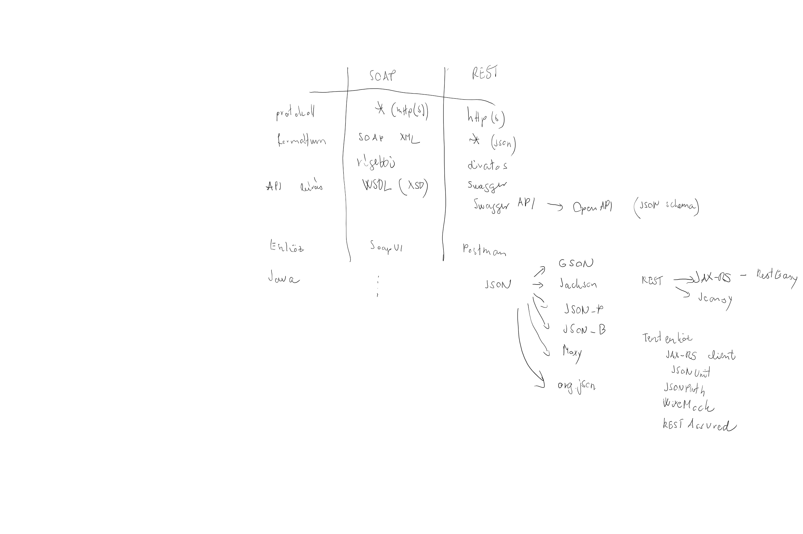
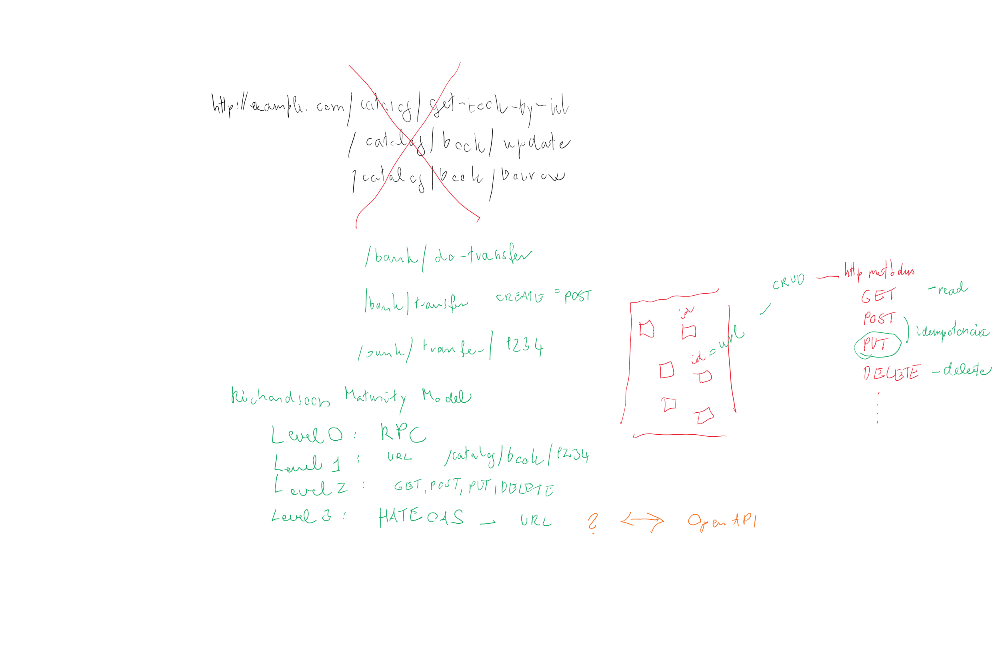

# Integrációs technológiák

## XML, SOAP

* Mire való a névtér?
* Mi az az XML séma? Mivel definiált az XML séma?
* Mire való az XPath? Milyen részekből áll? Hol használható?
* Milyen XML eszközöket ismersz?
* Mire való az XSLT?
* Java-ban milyen API-k vannak XML kezelésre? Mi része a standard Javanak? Milyen különbségek vannak köztük?
* Mi az az XML entity reference?
* Mi az az XML bomb?
* Mi az a CDATA?
* Mikor elem, mikor attribútum?
* Vannak-e elnevezési konvenciók?
* Hogyan tesztelsz XML feldolgozást?
* Milyen szabványokat ismert SOAP webszolgáltatásokra Java-ban? Milyen implementációkat?
* Kód- és sémagenerálás mennyire elfogadható?
* Hogyan akadáloyzzuk meg, hogy a teljes XML betöltésre kerüljön?
* SOAP/WSDL lehetővé teszi, hogy egymással kommunikálni tudjanak eltérő technológiák?

### Említendő

* Four Tenets of SOA
	* Boundaries Are Explicit: tiszta és egyszerű API, tipikusan durva szemcsézettségű
	* Services Are Autonomous: laza kapcsolat, ne kelljen az operációkat meghatározott sorrendben meghívni, nem hagyhatja egy operáció inkonzisztens állapotban, tipikusan egy tranzakciónyi egy operáció
	* Services Share Schema and Contract, Not Class: black box, csak az interfészleírás (WSDL) megosztott
	* Service Compatibility is based on Policy: kommunikáció szabályai deklarálandók, WS-Policy írja le a szabályokat, pl. security, quality of service

SOAP stílus, kódolás:

* Stílus
    * RPC-stílus
    * Document stílus
* Kódolás
    * Literal-kódolás
    * SOAP-kódolás = encoded
* Paraméter
    * Unwrapped (bare)
    * Wrapped
* Leggyakrabban használt: Document/literal

https://www.ibm.com/developerworks/webservices/library/ws-whichwsdl/

## HTTP, REST

### Említendő

* REST Architectural Constraints
	* Uniform interface: erőforrások, URI-val azonosítva, metódusok, leíró üzenetek, HATEOAS (linkek a részletekre)
	* Client–server: egymástól függetlenek, kliens csak az URL-jét tudja a szervernek
	* Stateless: nincs session (autentikáció - minden kérésben küldeni kell)
	* Cacheable: támogassa a cache-elést akár szerver, akár kliens oldalon
	* Layered system: nem kell a kliens és szerver között közvetlen kapcsolat, más eszközök is beékelődhetnek (security, loadbalancing, stb.)
	* Code on demand (optional): visszaadhat futtatható kódrészleteket
* Richardson Maturity Model
	* Level 0: HTTP használata, gyakorlatilag RPC, HTTP mint transzport
	* Level 1 - Resources: egyedileg azonosított erőforrások
	* Level 2 - HTTP Verbs: HTTP metódusok használata annak jelentése alapján
	* Level 3 - Hypermedia Controls: discoverability, linkek, hogy merre lehet továbbmenni
* OpenAPI
* Postman
* Swagger

